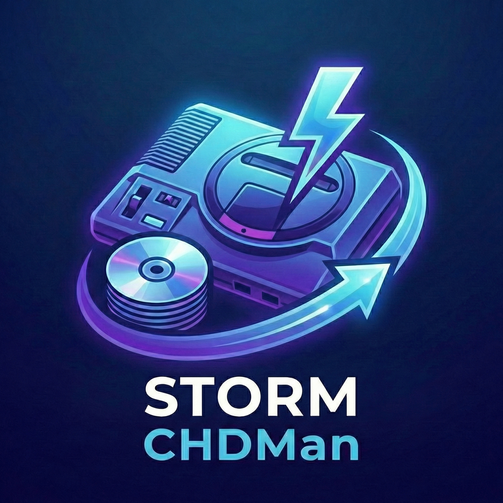

# STORM CHDMan

### 🇷🇺 Особенности программы (Russian)

1. **⚡ Сжатие и распаковка:** Быстрая конвертация образов дисков в формат CHD и обратно (CUE, GDI, ISO).
2. **📂 Поддержка систем:** Работа с образами для PS1, PS2, Saturn, Dreamcast, 3DO и других консолей.
3. **🔍 Распознавание платформ:** Автоматическое определение системы на основе Redump DAT-файлов.
4. **🔢 Поиск серийников:** Сканирование файлов для извлечения серийного номера игры.
5. **⚙️ Система пресетов:** Индивидуальные настройки сжатия и размера блока (Hunk) для каждой платформы.
6. **📱 Оптимизация для AetherSX2:** Специальный режим для мобильных эмуляторов (Zlib + оптимальные блоки).
7. **🧵 Многопоточность:** Полная поддержка многоядерных процессоров для максимальной скорости.
8. **📥 Drag & Drop:** Мгновенное добавление файлов в таблицу с фоновой подгрузкой метаданных.
9. **🔄 Рекурсивный поиск:** Автоматическое сканирование всех вложенных папок.
10. **📊 Контроль сжатия:** Отображение исходного/конечного размера и расчет итогового процента экономии.
11. **🌐 Мультиязычность:** Полная поддержка русского и английского интерфейсов.
12. **🌙 Современный UI:** Темная тема с акцентными цветами и Real-time статусом обработки.
13. **💾 Сохранение состояния:** Запоминание размеров окна, ширины колонок и настроек путей.
14. **⚡ Менеджер DAT-файлов:** Встроенная загрузка и обновление баз данных Redump "в один клик".
15. **🛡️ Хеширование SHA1:** Расчет контрольных сумм для точной идентификации игр.
16. **🔄 Авто-обновление:** "Умная" проверка версий и надежное обновление с чистым перезапуском.
17. **🚀 Портативность:** Работает как одиночный EXE-файл без необходимости установки.
18. **🖱️ Контекстное меню:** Удобное управление, **перехэширование** и быстрый переход к папкам.
19. **📦 Поддержка архивов:** Автоматическая распаковка ZIP, 7Z и RAR с последующей очисткой.
20. **🧹 Умная очистка:** Автоматическое удаление временных файлов при старте и после работы.
21. **🛠️ Интегрированный CHDMan:** Все необходимые инструменты уже вшиты внутрь приложения.
22. **⚡ Умное кэширование:** Мгновенное определение серийных номеров для ранее обработанных файлов (SHA1 кэш).

---

### 🇬🇧 Features (English)

1. **⚡ Compression & Extraction:** High-speed conversion of disk images to CHD and back (CUE, GDI, ISO).
2. **📂 System Support:** Works with images for PS1, PS2, Saturn, Dreamcast, 3DO, and other consoles.
3. **🔍 Platform Recognition:** Automatic system detection using Redump DAT files.
4. **🔢 Serial Detection:** Scanning files to extract the game's serial number.
5. **⚙️ Preset System:** Individual compression settings and hunk sizes for each platform.
6. **📱 AetherSX2 Optimization:** Special mode for mobile emulators (Zlib + optimal block sizes).
7. **🧵 Multithreading:** Full support for multi-core processors for maximum performance.
8. **📥 Drag & Drop:** Instant file adding to the list with background metadata fetching.
9. **🔄 Recursive Scanning:** Automatic file discovery in all nested subdirectories.
10. **📊 Compression Metrics:** Real-time size display and final savings percentage calculation.
11. **🌐 Multilingual:** Full support for Russian and English languages.
12. **🌙 Modern UI:** Dark theme with accent colors and real-time processing status.
13. **💾 State Persistence:** Remembers window size, column widths, and path settings.
14. **⚡ DAT Manager:** Built-in one-click download and update for Redump databases.
15. **🛡️ SHA1 Hashing:** Checksum calculation for precise game identification.
16. **🔄 Auto-Update:** Smart version checking and robust updates with clean restart logic.
17. **🚀 Portability:** Runs as a standalone EXE file with no installation required.
18. **🖱️ Context Menu:** Row management, **Rehash** option, and "Open File Location" support.
19. **📦 Archive Handling:** Automated extraction of ZIP, 7Z, and RAR with post-cleanup.
20. **🧹 Intelligent Cleanup:** Automatic removal of temporary folders on startup and after processing.
21. **🛠️ Integrated CHDMan:** All necessary backend tools are bundled within the application.
22. **⚡ Smart Caching:** Instant detection of serial numbers for previously processed files (SHA1 cache).
